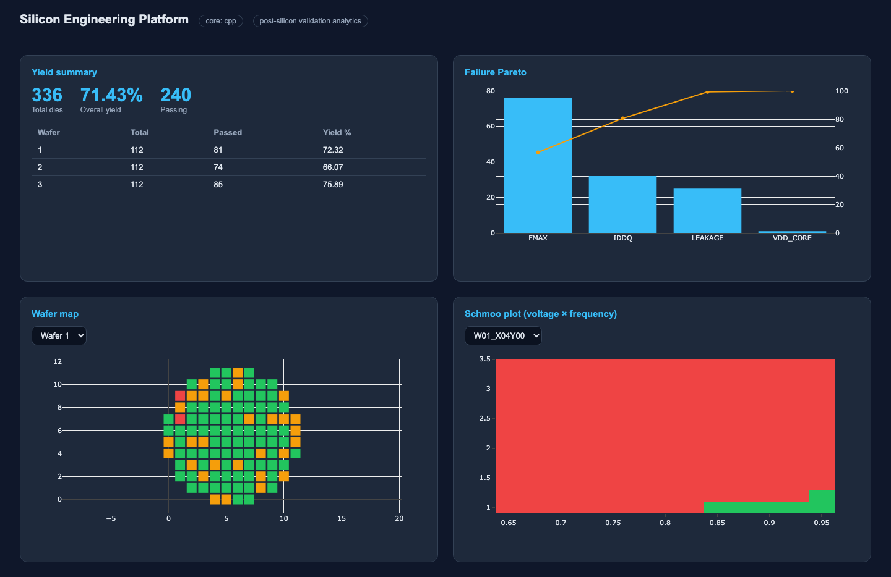
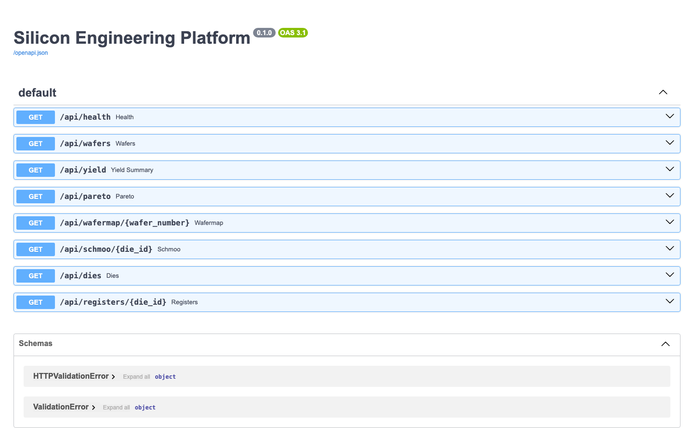

# Silicon Engineering Platform

[](https://github.com/aminalav/Post-Silicon-Validation-Tools/actions/workflows/ci.yml)


A post-silicon validation analytics platform: it generates realistic synthetic
silicon test data, parses and decodes it with a **C++ core** (exposed to Python
via pybind11), stores it in a relational database, runs **yield & failure
analysis**, and serves it through a **FastAPI + React** dashboard with **Schmoo
plots** and **wafer maps** — plus automated HTML/PDF reports.

> Built to demonstrate post-silicon validation domain skills alongside
> production-grade software engineering across C++, Python, SQL, and web.
> See [`BUILD_PLAN.md`](BUILD_PLAN.md) for the design and 2-week roadmap.

## Dashboard



Yield summary, failure Pareto, wafer map (spatial pass/fail with realistic
radial yield loss), and a Schmoo plot (voltage × frequency operating envelope).
The `core: cpp` badge indicates the compiled C++ parser is active.

Auto-generated REST API (FastAPI / OpenAPI):



## Architecture

```
 datagen (Python) ──► tests.log / *.csv ──► C++ core (parse + decode, pybind11)
        │                                          │
        └──────────────► ingest (SQLAlchemy) ──► SQLite ──► analysis (pandas)
                                                     │            │
                                            FastAPI API ◄─────────┘
                                                     │
                                          React dashboard + reports
```

## Quickstart

### Option A — Docker (one command)

```bash
docker compose up --build
# API:       http://localhost:8000/docs
# Dashboard: http://localhost:5173
```

### Option B — Local

Requires Python 3.10+, a C++17 compiler, and CMake (for the compiled core;
without it the platform automatically falls back to a pure-Python parser).

```bash
# 1. Install (compiles the C++ extension via scikit-build-core + pybind11)
pip install -e ".[dev]"

# 2. Generate data, load the DB, and write a report in one shot
sep demo

# 3. Serve the API, then run the dashboard
sep serve                     # http://localhost:8000
cd frontend && npm install && npm run dev   # http://localhost:5173
```

Check which parsing backend is active:

```bash
sep info        # -> core backend: cpp   (or: python)
```

## CLI

| Command | Purpose |
|---|---|
| `sep generate` | Generate a synthetic post-silicon lot |
| `sep ingest <lot_dir>` | Load a lot into the database |
| `sep yields` | Print the yield summary |
| `sep report <lot_id>` | Write an HTML report (`--pdf` for PDF) |
| `sep decode 0xA000830D` | Decode a raw register value into fields |
| `sep serve` | Run the FastAPI server |
| `sep demo` | generate → ingest → report in one step |

## API endpoints

`/api/health`, `/api/yield`, `/api/pareto`, `/api/wafers`,
`/api/wafermap/{n}`, `/api/schmoo/{die_id}`, `/api/dies`,
`/api/registers/{die_id}`. Interactive docs at `/docs`.

## The C++ core

Two compiled components live in [`cpp/`](cpp/) and are exposed as the
`sep_core` module:

- **`log_parser`** — a streaming, zero-copy (`string_view`) test-log parser.
- **`reg_decoder`** — spec-driven bitfield extraction and expected/actual compare.

They sit on the critical data path (used by ingest and the API). If the
extension isn't built, [`sep/core.py`](sep/core.py) provides a pure-Python
fallback with an identical interface.

## Testing

```bash
pytest            # Python: core + end-to-end pipeline
```

## Project layout

```
cpp/        C++ core (log parser, register decoder) + pybind11 bindings
sep/        Python package: datagen, db, analysis, api, reports, cli
frontend/   React + Vite dashboard (Plotly)
specs/      Example register specification
tests/      pytest suite
```

## License

MIT (see the repository for details).
